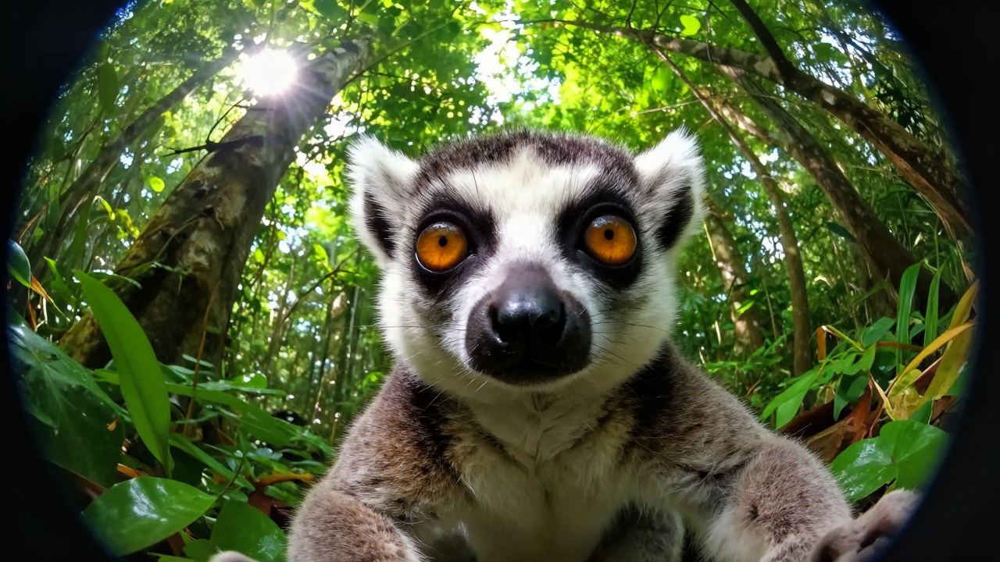
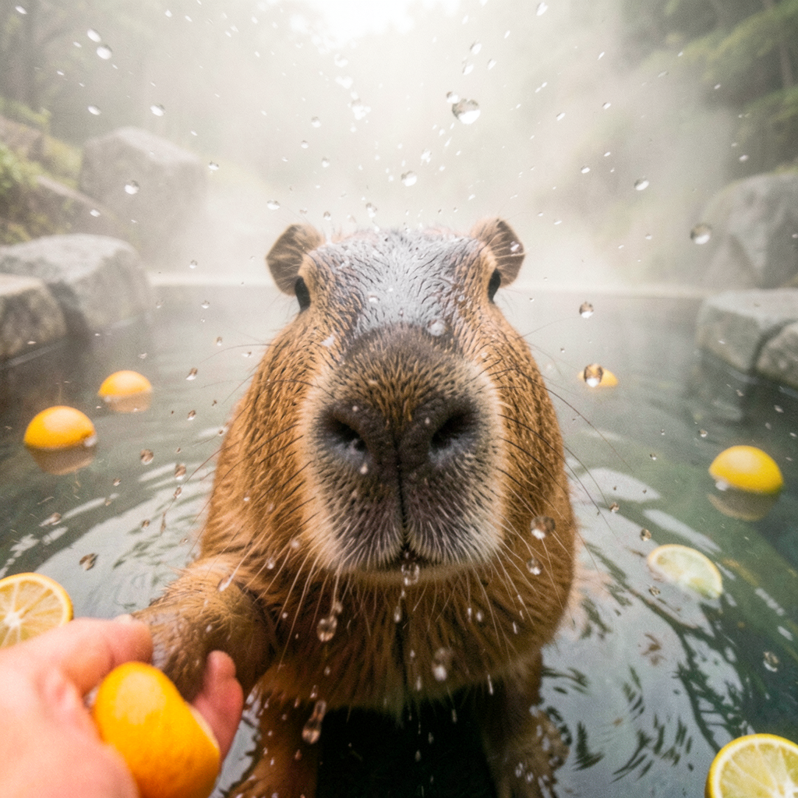

# Funny Animal Selfies

**Status:** verified Fruth reference run  
**Run and review date:** 2026-09-18  
**Response:** `resp_1789747143885_0bfdac3579e688`  
**Final frame:** `resp_1789747143885_0bfdac3579e688:frame-2`

## Request

```text
Create a playful series of exactly three funny animal selfies. Choose the animals, settings, poses, and visual style yourself, but make the three images clearly distinct. Then inspect each generated image separately and briefly describe only what is actually visible, including any accidental readable text or obvious visual defect.
```

## Result

Fruth generated exactly three distinct images: a lemur-like primate in a forest,
a penguin wearing sunglasses at an ice rink, and a capybara in a misty hot spring.
Each image was supplied to its own vision-analysis branch before the combined
report was published.

### Image 1



### Image 2


### Image 3



## Recorded combined inspection

The final response returned this model-authored inspection:

> ## Visual Inspection — Per-Image Report
>
> **Image 1:** Small nocturnal primate filling the frame, looking directly at the camera—large round amber/orange eyes ringed by bold black markings, white face and muzzle, grayish-brown fur, rounded ears, dark nose/mouth area. Framing is a low-angle close-up with a circular fisheye/wide-angle vignette; strong barrel distortion curves the background foliage inward. Background: dense green forest undergrowth (broad leaves, grasses, tree trunks) with bright sunburst flare bursting through the canopy in the upper-left. No readable text; no obvious defects beyond intentional lens distortion/vignetting.
>
> **Image 2:** Penguin with black-and-white plumage wearing large reflective mirrored sunglasses, positioned eye-level and prominently centered on an indoor ice rink. Background: blurred ice-rink environment with bright out-of-focus lights (bokeh). No readable text; no obvious visual defects detected.
>
> **Image 3:** Capybara in a steaming outdoor hot spring—low-angle close-up with face centered and sharply focused, large dark nose and wet fur prominent. Water droplets scattered across the frame as frozen splashes and motion-blurred streaks. Bottom-left foreground: human hand holding an orange citrus fruit toward the capybara's paw. Several yellow/green citrus fruits floating in the surrounding dark water. Background: large rocks obscured by heavy mist/steam. No readable text; no obvious visual defects detected.

## Image-consumption evidence

Each receipt records the SHA-256 of the actual image supplied to the named
consumer. These are observed branch executors, not a list of merely available
or preferred models.

| Image | Generation executor | Inspection executor | Consumed image SHA-256 |
| --- | --- | --- | --- |
| 1 | `x/z-image-turbo:latest` | `ornith-1.5:9b` | `1c2546bfa704849a8f780ebd96822e0fee640d60c26d6bfcb378c567737b856d` |
| 2 | `x/flux2-klein:latest` | `mlx-community/gemma-4-E4B-it-qat-8bit` | `92beb107d6b4afa47aa5ed1571ac3236a0d6cd53278651138a8a9d370274d826` |
| 3 | `x/flux2-klein:latest` | `gemma4:26b` | `d35e7be7b7b6288d9346980b98aa50d9c76da3b2f219ee811e63e2be14e15f86` |

```json
[
  {
    "authority": "runtime_vision_image_dispatch",
    "branch_id": "branch-vision_analysis-1",
    "image_sha256": "1c2546bfa704849a8f780ebd96822e0fee640d60c26d6bfcb378c567737b856d",
    "instance_id": "ornith-1.5:9b-1",
    "kind": "fruth.vision_input_evidence",
    "phase_id": "phase-5",
    "response_id": "resp_1789747143885_0bfdac3579e688",
    "size_bytes": 1529588,
    "status": "supplied",
    "version": 1
  },
  {
    "authority": "runtime_vision_image_dispatch",
    "branch_id": "branch-vision_analysis-2",
    "image_sha256": "92beb107d6b4afa47aa5ed1571ac3236a0d6cd53278651138a8a9d370274d826",
    "instance_id": "mlx-community__gemma-4-E4B-it-qat-8bit-mlx-11501",
    "kind": "fruth.vision_input_evidence",
    "phase_id": "phase-6",
    "response_id": "resp_1789747143885_0bfdac3579e688",
    "size_bytes": 1367968,
    "status": "supplied",
    "version": 1
  },
  {
    "authority": "runtime_vision_image_dispatch",
    "branch_id": "branch-vision_analysis-3",
    "image_sha256": "d35e7be7b7b6288d9346980b98aa50d9c76da3b2f219ee811e63e2be14e15f86",
    "instance_id": "gemma4:26b-1",
    "kind": "fruth.vision_input_evidence",
    "phase_id": "phase-7",
    "response_id": "resp_1789747143885_0bfdac3579e688",
    "size_bytes": 1657592,
    "status": "supplied",
    "version": 1
  }
]
```

The published report is retained as returned, including its qualitative defect
assessment. Digest-bound image dispatch establishes what was inspected; it does
not make every visual interpretation infallible. Publication review also viewed
all three saved images without modifying them.

## Runtime truth and monitor snapshot

| Evidence | Verified state |
| --- | --- |
| Response lifecycle | `completed`, terminal |
| Late fill | `completed`; zero failed or pending branches |
| Final materialization contract | `fulfilled` |
| Graph Closure | `fulfilled`; no open continuation or actionable repair |
| Surface state | `fulfilled` |
| Saved artifact count | 3 |
| Independent monitor | `clean` for this exact final frame |
| Missing files / SHA mismatches / HTML or CSS issues | zero |

The monitor snapshot was recorded at `2026-09-18T16:09:35.973739Z`. Publication
review rechecked the source files and recorded hashes, as well as existing bundle
hashes and relative links where present. The exporter independently verified the
indexed frame, its terminal state, matching monitor evidence and exact prompt.

## Why this is a reference

This run demonstrates how three independent image artifacts are each consumed by a separate vision branch and then joined into one report.

It is one observed Fruth execution of this prompt. Broader conformance and model
quality claims require their own evidence.

## Publication Package

This directory is a sanitized, immutable publication copy of the reviewed run. It does not replace the original response frame or runtime artifacts.

- [Exact reviewed prompt](prompt.txt)
- [Sanitized final response truth](response.json)
- [Sanitized independent monitor snapshot](monitor-report.json)
- [Package checksums and provenance](manifest.json)
